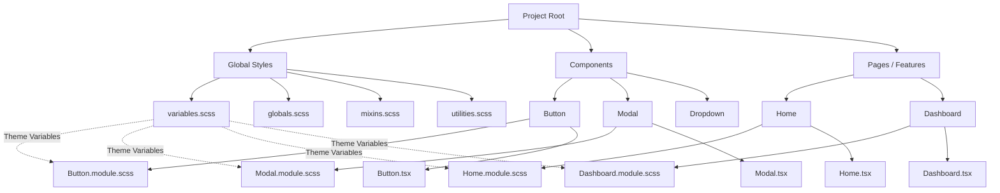
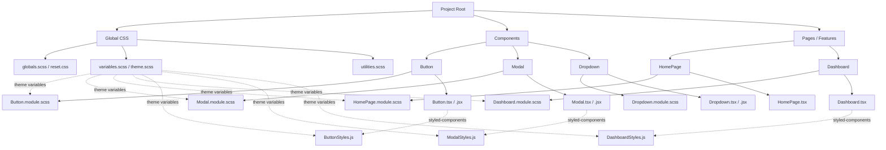

# How would you organize CSS on huge project?

For a **huge frontend project**, organizing CSS well is crucial to maintainability, scalability, and performance. Here’s a structured approach that a senior frontend dev would typically consider:

---

## **1️⃣ Adopt a Component-Based Structure**

If your project uses **React / Vue / Angular**, organize CSS **per component** whenever possible.

* **CSS Modules or SASS Modules**: Each component gets its own `.module.css` or `.module.scss`.
* Co-locate styles with components:

  ```plaintext
  /components/Button/
    Button.tsx
    Button.module.scss
  ```

**Benefits:**

* Styles are scoped to the component → no collisions.
* Easier to refactor or move components.

---

## **2️⃣ Global Styles / Theme**

Some things are **global** and should be centralized:

* **CSS Variables (Custom Properties)** for colors, spacing, fonts, breakpoints.
* **Reset / Normalize CSS** (like `normalize.css`).
* **Global utility classes** (e.g., `.hidden`, `.sr-only`).

Example:

```
/styles/
  variables.scss
  globals.scss
  mixins.scss
  utilities.scss
```

* Import global styles at the top level (App root).

---

## **3️⃣ Use a CSS Methodology**

Structured naming helps avoid conflicts:

* **BEM (Block-Element-Modifier)** → classic, works well with vanilla CSS/SASS.
* **SMACSS / ITCSS** → scale better for huge projects with layered architecture.

**Example BEM:**

```scss
.button { }
.button__icon { }
.button--primary { }
```

---

## **4️⃣ Preprocessor / PostCSS**

* Use **SASS / SCSS** for nesting, variables, and mixins.
* Optionally use **PostCSS** for autoprefixing, minification, and modern CSS features.

---

## **5️⃣ Modular & Lazy-Loaded Styles**

* Split CSS per **feature / route / page**.
* Only load styles that are needed for the page → reduces initial load time.
* Combine with **code splitting** in React / Vue.

---

## **6️⃣ Utility / Atomic Classes (Optional)**

* TailwindCSS or custom utility classes for repetitive styling.
* Works well alongside component styles to reduce duplication.

---

## **7️⃣ Theming & Dark Mode**

* Use **CSS variables** for colors, fonts, spacing.
* Switch themes by changing root variables.
* Example:

```scss
:root {
  --color-primary: #1a73e8;
}
[data-theme="dark"] {
  --color-primary: #8ab4f8;
}
```

---

## **8️⃣ Folder Structure Example for Huge Project**

```
/src
  /components
    /Button
      Button.tsx
      Button.module.scss
    /Modal
      Modal.tsx
      Modal.module.scss
  /pages
    /Home
      Home.tsx
      Home.module.scss
  /styles
    globals.scss
    variables.scss
    mixins.scss
    utilities.scss
```

---

## **9️⃣ Best Practices**

* Keep selectors **shallow**, avoid deep nesting.
* Prefer **composition over inheritance**.
* Use **CSS Modules or Styled Components** to prevent leakage.
* **Audit unused CSS** periodically (DevTools coverage).
* Document design tokens (colors, spacing, typography).

---

✅ **Summary**:

* Component-level CSS (modules)
* Global styles for themes, resets, utilities
* CSS methodology (BEM / ITCSS)
* Preprocessor (SASS) or PostCSS
* Lazy-loading & splitting for performance
* Utility classes for repeatable patterns

---


### **Mermaid Diagram (CSS Organization)**



---

### **How to read it**

* **Global Styles** (`B`)

  * Centralized variables, mixins, utilities.
  * Shared across all components and pages.

* **Components** (`C`)

  * Each component has a `.module.scss` for scoped styles.
  * Styles live next to the component code.

* **Pages / Features** (`D`)

  * Larger page-level or feature-level styles.
  * Also scoped via CSS Modules.

* **Theme Variables** (dashed arrows)

  * Variables from `variables.scss` are consumed by both components and pages for consistent colors, fonts, spacing.

---

✅ **Key Takeaways**

1. **Local + Global balance** → component isolation + reusable themes.
2. **Scalable folder structure** → easy to navigate and maintain.
3. **Future-proof** → adding new components or features doesn’t pollute global CSS.

---


### **Mermaid Diagram: CSS Types in a Huge Project**



---

### **Explanation**

1. **Global CSS**

   * Resets, base styles, utility classes, and theme variables.
   * Shared across all components and pages.

2. **CSS Modules**

   * Component-scoped styles (`.module.scss`).
   * Keeps styles isolated and prevents conflicts.

3. **Styled Components**

   * Optional CSS-in-JS for dynamic or prop-driven styles.
   * Can consume the same theme variables as global or CSS Modules.

4. **Theme Variables**

   * Centralized variables (`variables.scss`) flow into **all CSS types** for consistent colors, spacing, and fonts.

---

✅ **Benefits of this structure**

* **Isolation + Scalability**: Components can use CSS Modules or Styled Components while global styles provide shared resources.
* **Maintainable**: Easy to add/remove components or pages without breaking unrelated styles.
* **Flexible**: Mix of CSS Modules + Styled Components works well in large teams.

